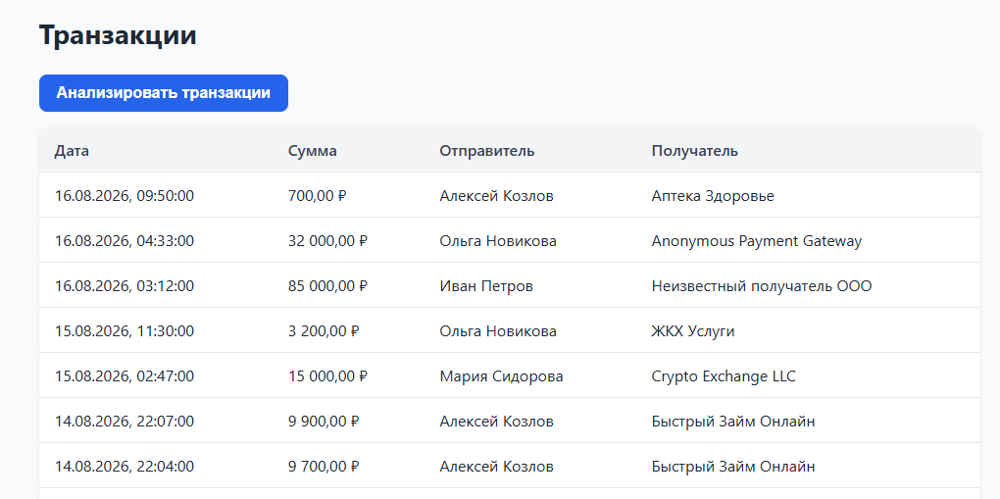
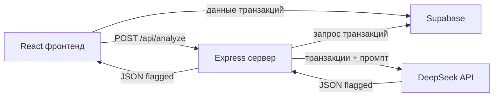

# Fraud Agent MVP

> **Примечание.** Это pet-проект, разработанный в одиночку. Документация сознательно не оформлялась по стандартам enterprise-проектов, поскольку реализовывался небольшой функционал. Примеры оформления документации можно посмотреть в других проектах автора. Вся необходимая информация по архитектуре, подходам и работе данного приложения собрана в этом файле README.

**Fraud Agent MVP** — MVP-приложение для автоматического выявления подозрительных финансовых транзакций с помощью ИИ. Аналитик по антифроду видит таблицу транзакций, запускает анализ одним кликом и получает список подозрительных операций с понятным объяснением и уровнем риска.

<p align="center">
  
</p>

[Последний деплой](https://fraud-agent-mvp.vercel.app/)

## Возможности

- Загрузка списка транзакций из Supabase.
- Таблица с датой, суммой, отправителем, получателем и отметкой подозрительности.
- Один клик «Анализировать транзакции» → анализ через DeepSeek.
- Вывод подозрительных транзакций в виде карточек с уровнем риска (`low` / `medium` / `high`).
- Объяснение причины подозрения простым языком.

## Как это работает

1. Фронтенд загружает транзакции из таблицы `transactions` в Supabase.
2. По нажатию кнопки отправляет `POST /api/analyze` на Express-сервер.
3. Сервер забирает все транзакции из Supabase и отправляет их в DeepSeek API (`deepseek-chat`) вместе с системным промптом.
4. Системный промпт описывает признаки подозрительности: нетипичная сумма, новый получатель, ночные операции (00:00–05:00), дробление сумм для обхода лимитов.
5. ИИ возвращает строгий JSON `{ "flagged": [...] }`, сервер парсит его (с fallback через регулярное выражение).
6. Фронтенд отображает результат.



## Технологический стек

- **Frontend:** React 18, TypeScript, Vite, CSS.
- **Backend:** Node.js, Express, tsx.
- **База данных:** Supabase (PostgreSQL).
- **ИИ:** DeepSeek API (модель `deepseek-chat`).
- **Инструменты:** concurrently, dotenv, cors.

## Структура проекта

```
fraud-agent-mvp/
├── server/
│   └── index.ts              # Express-сервер и логика анализа
├── src/
│   ├── App.tsx               # Главный компонент приложения
│   ├── components/
│   │   └── TransactionsTable.tsx
│   ├── supabaseClient.ts     # Клиент Supabase (браузер)
│   ├── types.ts              # TypeScript-типы
│   └── App.css               # Стили
├── .env.example
├── package.json
├── tsconfig.json
└── vite.config.ts            # Прокси /api → localhost:3001
```

## Установка и запуск

```bash
npm install
cp .env.example .env   # заполнить ключи
npm run dev            # параллельно запускает клиент и сервер
```

Клиент: `http://localhost:5173`, API: `http://localhost:3001`.

Отдельно:

```bash
npm run dev:client
npm run dev:server
```

Сборка: `npm run build`, проверка типов сервера: `npm run typecheck:server`.

## Переменные окружения

| Переменная | Назначение |
|---|---|
| `VITE_SUPABASE_URL` | URL Supabase (фронтенд) |
| `VITE_SUPABASE_ANON_KEY` | Публичный ключ Supabase (фронтенд) |
| `SUPABASE_URL` | URL Supabase (сервер) |
| `SUPABASE_ANON_KEY` | Публичный ключ Supabase (сервер) |
| `DEEPSEEK_API_KEY` | Ключ DeepSeek API |

## API

- `GET /api/health` → `{ "ok": true }`
- `POST /api/analyze` → `{ "flagged": [...] }`

## Таблица данных в Supabase

Колонки: `id`, `transaction_date`, `amount`, `sender`, `receiver`, `is_flagged`, `created_at`.
